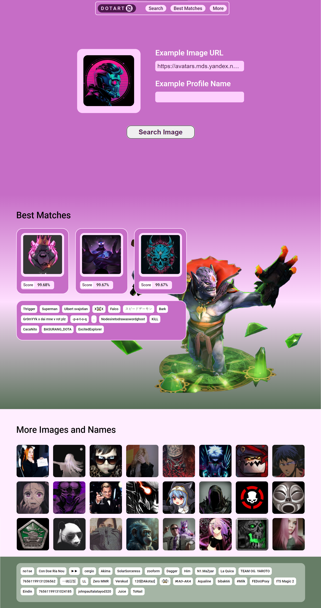

<pre class="project-title">
▓█████▄  ▒█████  ▄▄▄█████▓ ▄▄▄       ██▀███  ▄▄▄█████▓
▒██▀ ██▌▒██▒  ██▒▓  ██▒ ▓▒▒████▄    ▓██ ▒ ██▒▓  ██▒ ▓▒
░██   █▌▒██░  ██▒▒ ▓██░ ▒░▒██  ▀█▄  ▓██ ░▄█ ▒▒ ▓██░ ▒░
░▓█▄   ▌▒██   ██░░ ▓██▓ ░ ░██▄▄▄▄██ ▒██▀▀█▄  ░ ▓██▓ ░
░▒████▓ ░ ████▓▒░  ▒██▒ ░  ▓█   ▓██▒░██▓ ▒██▒  ▒██▒ ░
 ▒▒▓  ▒ ░ ▒░▒░▒░   ▒ ░░    ▒▒   ▓▒█░░ ▒▓ ░▒▓░  ▒ ░░
 ░ ▒  ▒   ░ ▒ ▒░     ░      ▒   ▒▒ ░  ░▒ ░ ▒░    ░
 ░ ░  ░ ░ ░ ░ ▒    ░        ░   ▒     ░░   ░   ░
   ░        ░ ░                 ░  ░   ░
 ░
</pre>

    <h1>🎮Dotart - The Art of Your Dota 2 Profiles🎨</h1>

  <em>Dotart</em> - the site for finding the avatar and nickname of the steam profile of dota 2 players is a site that provides an opportunity to find new creative avatars and profile names for Dota 2 players and many other games.

    

Disclaimer 
    This project was developed and provided for non-commercial research purposes. The data provided in this repository is taken from publicly available sources on the Internet and used randomly as part of research tasks.  
    The author of the project calls for thoughtful and respectful use of this material, and also encourages the spirit of love, peace and cooperation. We hope that the project will be useful and inspire constructive discussion and further research in the area of interest.  
    Please note that this project does not have any commercial purposes, and the author does not guarantee the accuracy or completeness of the data provided. All responsibility for the use of this material lies with the end user.  
    Sincerely, Corowka.

    <h2 class="section-title">📜Header</h2>
    

        
In the Header section, there is a navigation panel with the "Dota Profile" logo and links to various sections of the website: Search, Best Matches, and More Images and Names.

    

    <h2 class="section-title">🔍Search</h2>
    

        
The Search section provides users with the ability to input an image URL and a profile name to find corresponding creative avatars and profile banners.

    

    <h2 class="section-title">🏆Best Matches</h2>
    

        
The Best Matches section displays the top matches for creative avatars and profile banners, along with their ratings (Score). This helps users choose the most interesting options.

    

    <h2 class="section-title">📁More Images and Names</h2>
    

        
The More Images and Names section allows users to browse additional images and profile names to expand their selection.

    

    

    <h2 class="section-title">🌏 Data</h2>
    

        <table>
            <tr>
                <th>Description</th>
                <th>Data Type</th>
                <th>Count</th>
            </tr>
            <tr>
                <td>Russian and Ukrainian Avatars</td>
                <td>Images</td>
                <td>9750</td>
            </tr>
            <tr>
                <td>Russian and Ukrainian Nicknames</td>
                <td>Text</td>
                <td>12468</td>
            </tr>
            <tr>
                <td>English Nicknames</td>
                <td>Text</td>
                <td>13385</td>
            </tr>
            <tr>
                <td>Nicknames Generated by ChatGPT</td>
                <td>Text</td>
                <td>1908</td>
            </tr>
            <tr>
                <td>All Nicknames</td>
                <td>Text</td>
                <td>28681</td>
            </tr>
        </table>
    

